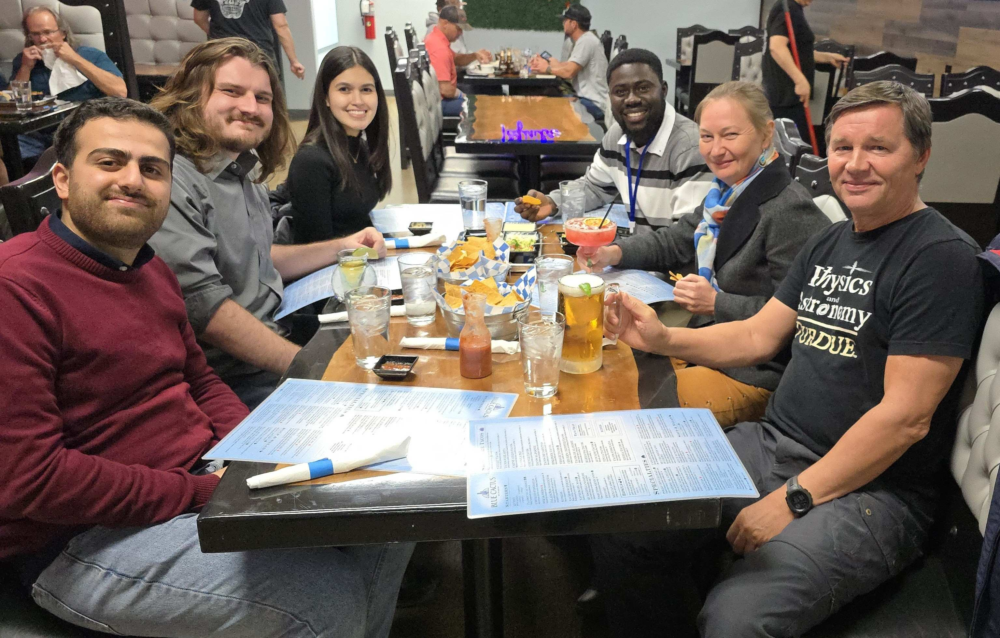
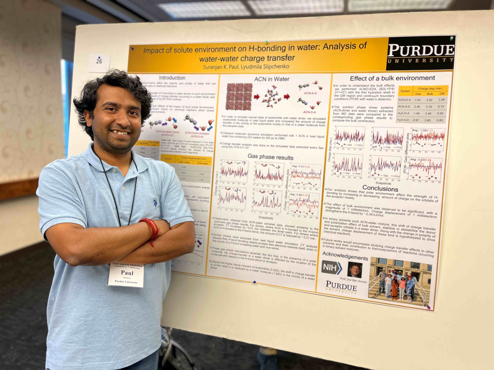
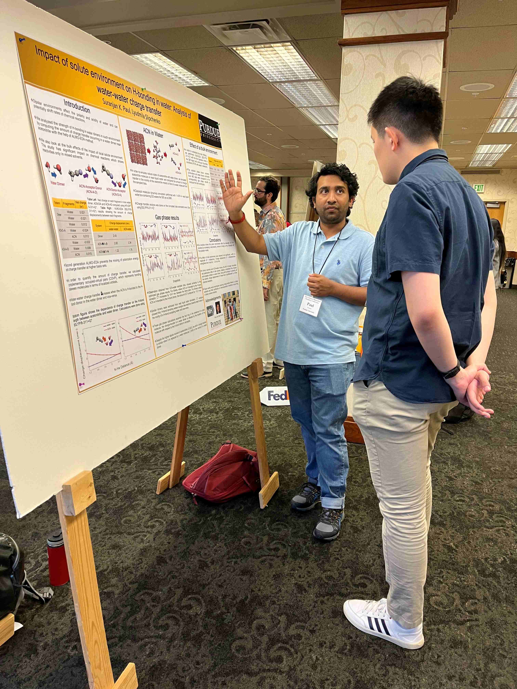
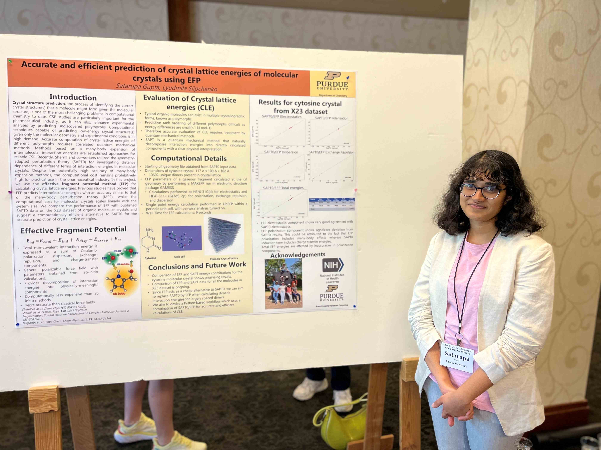
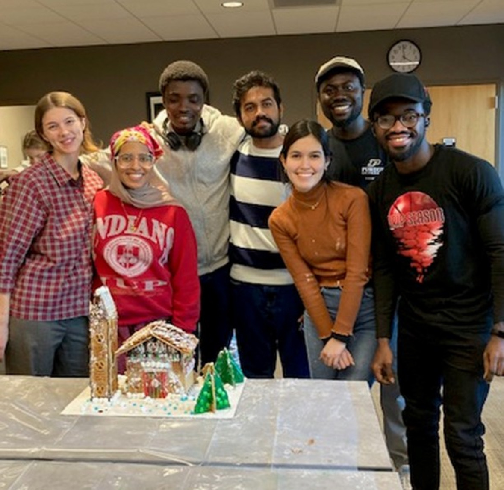
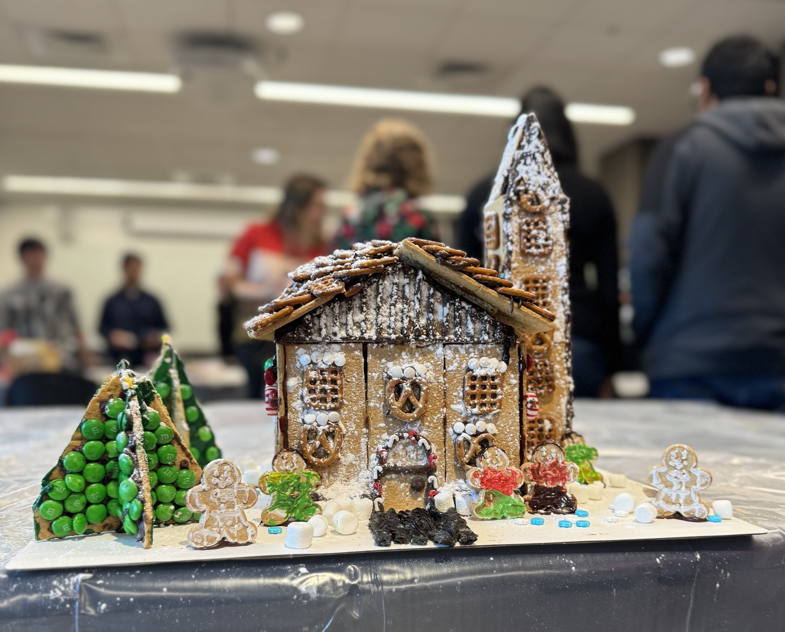
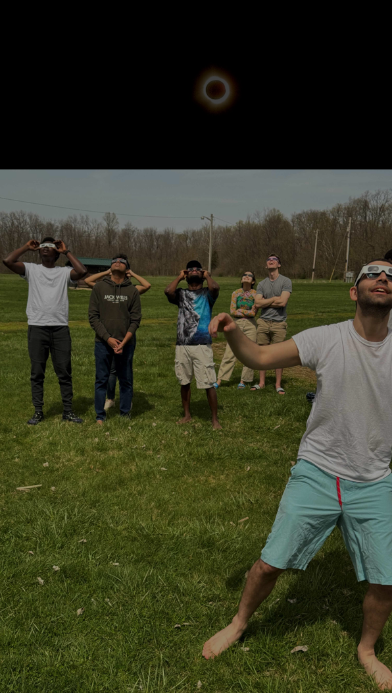
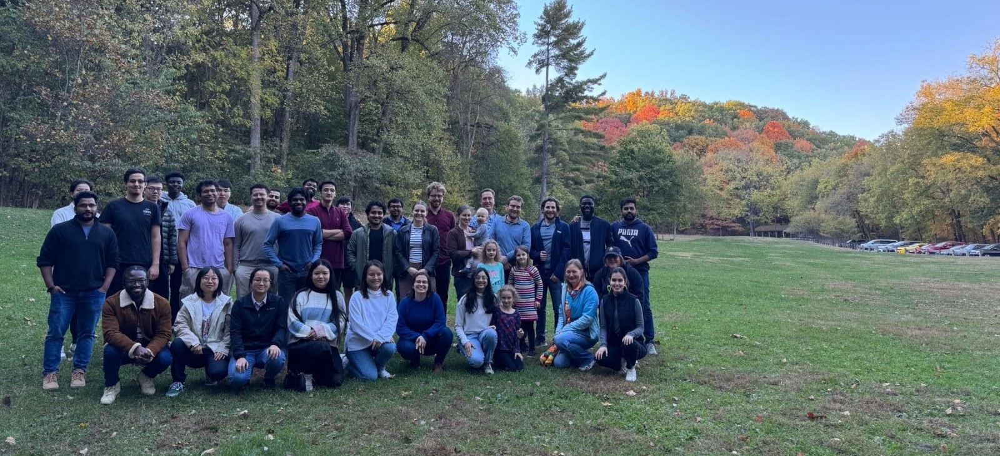
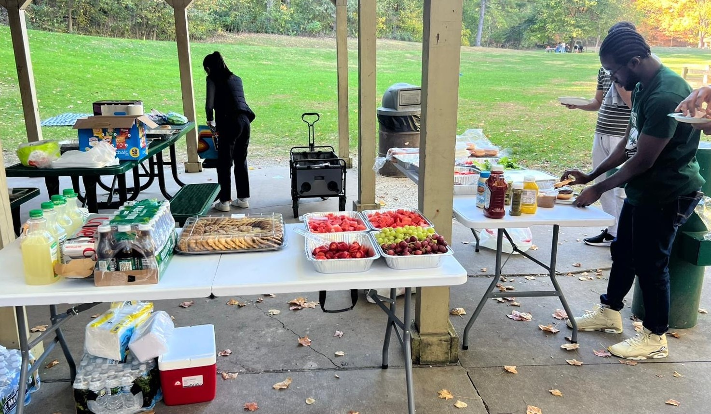
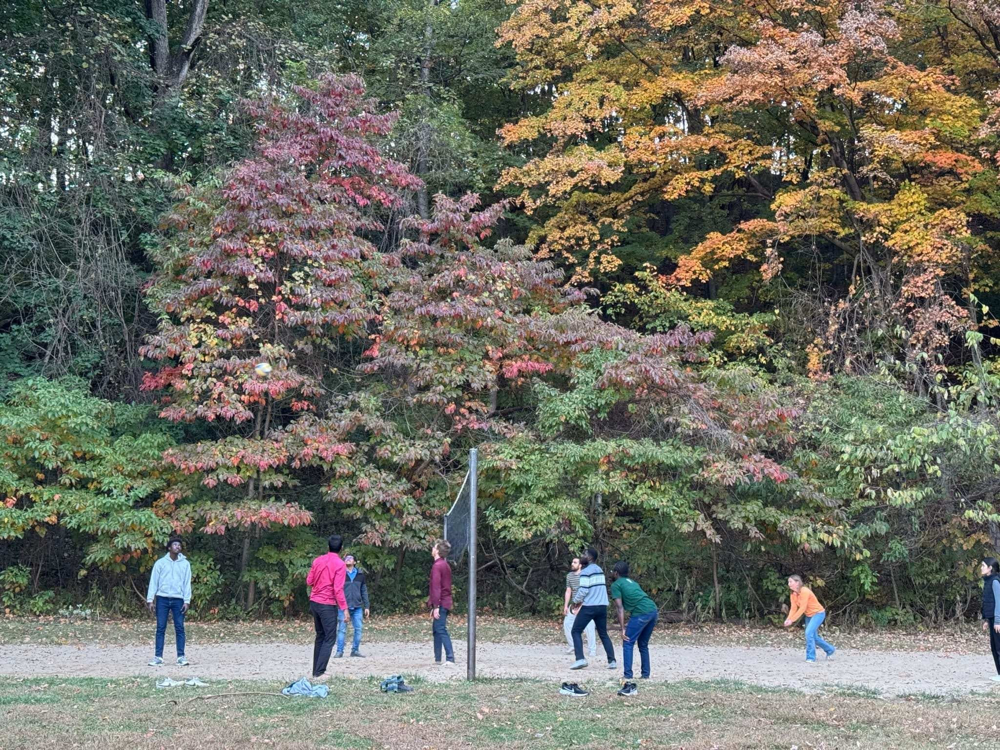

Events
======
Weekly Events
-------------

Group Meetings
--------------
Our group convenes twice a week to engage in discussions regarding our respective research projects.

Volleyball’s become a big part of our group culture—we’re hitting the COREC courts pretty often! 😄

.. image:: _static/images/vc.jpg
   :align: right
   :width: 50%

.. raw:: html

   

Conferences
-----------

Turkey Run Photosynthesis Conference 2024

.. raw:: html

   

.. raw:: html

   

.. raw:: html

   

.. raw:: html

   

Gatherings and Fun Events
-------------------------

Gingerbread House Competition
-----------------------------

On December 14th, 2023, the Physical Chemistry divisions of the Purdue Chemistry Department hosted a friendly gingerbread house competition, which provided an opportunity for members to engage in a lighthearted yet creative endeavor. Our group enthusiastically participated in this event, working collaboratively to construct an intricate and visually appealing gingerbread house.
The architectural vision for our creation was spearheaded by Luisa, a talented member of our team, whose meticulous planning and artistic flair guided the project from conception to completion.

  
Under her leadership, the rest of the team offered unwavering support, helping to transform her imaginative ideas into a tangible, edible masterpiece. Using gingerbread panels, assorted snacks, and confectionery elements, we brought her vision to life, crafting a structure that reflected creativity.
This shared experience provided an enjoyable outlet for creativity and camaraderie, serving as a welcome reprieve from the typical pressures of graduate studies during the winter season.

.. raw:: html

   

The Eclipsed Day
----------------

.. image:: _static/images/eclipsegp.png 
  :align: center
  :width: 100%
                        
----

On the 8th of April, 2024, we were privileged to witness one of nature’s most extraordinary phenomena, a solar eclipse. To fully appreciate this rare event, our group convened at Lake Waveland Park in Indiana, transforming the occasion into a memorable gathering. The excitement was palpable as we all chatted, eagerly awaiting the eclipse, but we had plenty of adventures planned to make the most of the day. The tranquil waters of the lake provided an ideal setting for kayaking, allowing participants to appreciate the beauty of the natural landscape. Others demonstrated their skill in windsurfing, gracefully maneuvering through the lake's breezes, while some opted to enjoy a refreshing swim.

The pinnacle of the day occurred as the solar eclipse approached. Utilizing appropriate viewing equipment, we observed with awe as the moon gradually obscured the sun, enveloping the park in an otherworldly twilight. The temperature dipped, the wind stilled, and for a brief, breathtaking moment, day turned into night. A profound silence fell over the gathering, as all present were unified in their appreciation of this rare and humbling celestial event.

.. image:: _static/images/eclipsev.png
   :align: right
   :width: 50%

Following the eclipse, we resumed our planned activities, partaking in the meal and engaging in reflective discussions about the extraordinary event we had just witnessed. Then we had a friendly volleyball game on the sandy shore, where the spirit of teamwork and light-hearted competition added to the day's enjoyment. This wasn’t just a day spent watching an eclipse; it was a day that reminded us that sometimes, the best moments in life are the ones we spend with the people who make our world a little brighter.

.. raw:: html

   

Pchem Picnic (2024)
-------------------

----

   
On October 18th, 2024, the annual Physical Chemistry DRG picnic brought our group together for an unforgettable afternoon at Happy Hollow Park, Shelter 3. 

We arrived early to set up and fired up the grill, filling the air with the aroma of sizzling patties. Our food table boasted a colorful spread of fruits, burgers, and refreshing drinks, all thoughtfully arranged with everyone's help. Faculty members joined in, sharing great conversations over delicious bites.

A group photo captured the joyful spirit of the day, sealing the moment in our memories. And, as tradition called, we hit the volleyball court! Though any of us were not pros, we laughed through the game, improving bit by bit. The real win? Strengthening friendships, unwinding, and making bonds that make our Pchem DRG team stronger than ever.

